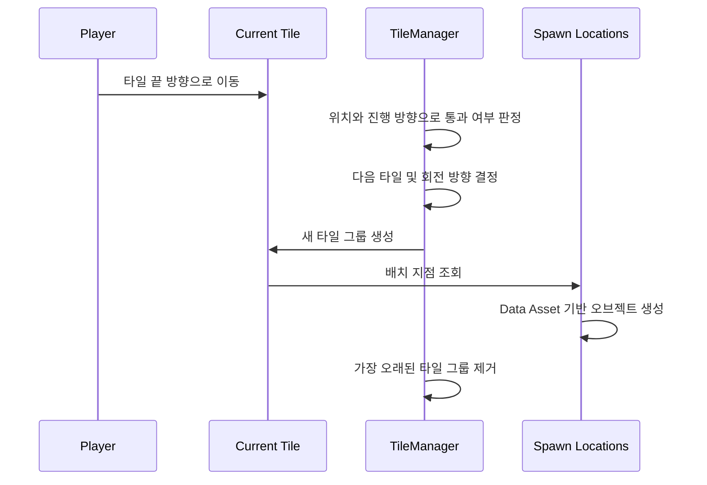

# 타일 및 스폰 루프

이 문서는 MuscleRun의 무한 진행 구조를 코드 중심으로 설명합니다. 공개 저장소에는 실행에 필요한 Content가 없으므로, 플레이 재현 절차가 아니라 구현 검토를 위한 문서입니다.

## 전체 흐름

핵심 진입점은 [`TileManager.cpp`](../Source/MuscleRun/Object/System/TileManager.cpp)입니다.

## 1. 타일 통과 판정

플레이어가 단순히 특정 월드 좌표를 넘었는지 확인하면, 진행 방향이 바뀌는 구간에서 같은 판정을 재사용하기 어렵습니다. 이 프로젝트는 타일 끝 지점과 진행 방향을 기준으로 벡터의 내적을 사용해 플레이어가 경계를 통과했는지 판단합니다.

이 방식의 장점은 다음과 같습니다.

- 월드 X축이나 Y축 중 하나에 판정을 고정하지 않아도 됩니다.
- 직선과 회전 이후 구간이 같은 규칙을 공유할 수 있습니다.
- 다음 타일의 방향 상태와 통과 판정을 함께 관리하기 쉽습니다.

## 2. 타일 그룹 생명주기

`TileManager`의 역할은 개별 타일 하나를 생성하는 데 그치지 않습니다.

1. 현재 활성 구간의 끝을 추적합니다.
2. 플레이어가 끝 지점을 통과하면 다음 타일 또는 타일 그룹을 생성합니다.
3. 회전 구간이라면 다음 진행 방향을 갱신합니다.
4. 유지 개수를 초과한 가장 오래된 타일 그룹을 제거합니다.

생성과 제거를 하나의 관리 주체에 모아, 오래 플레이해도 월드에 타일이 무제한으로 누적되지 않도록 했습니다.

## 3. 회전 구간 처리

회전 타일은 외형만 꺾이는 것이 아니라 이후 생성 좌표와 진행 방향도 바꿔야 합니다. `TileManager`는 현재 방향과 회전 결과를 상태로 유지하고, 다음 타일의 Transform 계산과 통과 판정에 같은 방향 정보를 사용합니다.

검토할 때는 다음 순서로 보면 이해하기 쉽습니다.

1. 현재 진행 방향을 나타내는 상태
2. 다음 타일을 생성하는 함수
3. 회전 타일 이후 방향을 갱신하는 지점
4. 새 방향을 통과 판정에 사용하는 지점

## 4. 스폰 위치와 데이터 분리

[`SpawnLocationComponent.cpp`](../Source/MuscleRun/Object/Tile/Component/SpawnLocationComponent.cpp)는 타일 내부에서 오브젝트를 놓을 수 있는 위치를 표현합니다. [`DA_SpawnableObjects.h`](../Source/MuscleRun/Object/Tile/DataAsset/DA_SpawnableObjects.h)는 해당 위치에 생성 가능한 대상을 데이터로 제공합니다.

이 분리로 얻는 효과는 다음과 같습니다.

- 타일 배치와 스폰 후보를 서로 독립적으로 수정할 수 있습니다.
- 같은 타일에서도 데이터 구성을 바꿔 다른 패턴을 만들 수 있습니다.
- 레벨 디자이너가 C++ 수정 없이 반복 조정할 수 있습니다.

실제 Data Asset 인스턴스와 Blueprint 설정은 공개되지 않은 Content에 있으므로, 저장소에서는 구조와 소비 코드만 확인할 수 있습니다.

## 5. 플레이어와의 연결

[`MRPlayerCharacter.cpp`](../Source/MuscleRun/Character/MRPlayerCharacter.cpp)는 플레이어의 이동 입력과 점프·슬라이드 상태를 처리합니다. 타일 매니저가 관리하는 진행 방향과 플레이어의 이동 상태가 함께 작동하면서, 직선과 회전 구간에서도 러너의 흐름이 이어집니다.

코드에는 Enhanced Input 액션 이름이 남아 있지만, 물리 키 매핑을 가진 `InputMappingContext` 에셋은 저장소에 없습니다. 따라서 액션 처리 로직은 검토할 수 있어도 실제 키 바인딩은 재현할 수 없습니다.

## 6. 함께 볼 코드

| 순서 | 파일 | 목적 |
| --- | --- | --- |
| 1 | [`TileManager.cpp`](../Source/MuscleRun/Object/System/TileManager.cpp) | 생성·통과·제거 전체 흐름 |
| 2 | [`SpawnLocationComponent.cpp`](../Source/MuscleRun/Object/Tile/Component/SpawnLocationComponent.cpp) | 스폰 지점 표현과 사용 |
| 3 | [`DA_SpawnableObjects.h`](../Source/MuscleRun/Object/Tile/DataAsset/DA_SpawnableObjects.h) | 스폰 대상 데이터 구조 |
| 4 | [`MRPlayerCharacter.cpp`](../Source/MuscleRun/Character/MRPlayerCharacter.cpp) | 플레이어 입력과 상태 처리 |
| 5 | [`MRSaveManager.cpp`](../Source/MuscleRun/Private/Save/MRSaveManager.cpp) | 진행 데이터 저장 구조 |

## 현재 한계

- 실제 타일 Blueprint와 Data Asset 인스턴스가 없어 생성 결과를 저장소만으로 재현할 수 없습니다.
- 상용 에셋과 전체 Content가 제외되어 프로젝트 단독 빌드가 불가능합니다.
- 입력 매핑과 Map 설정이 없어 실행 가능한 조작 안내를 제공할 수 없습니다.

구현 결과는 [플레이 영상](https://youtu.be/cj1qKMBmgKA)에서 확인할 수 있습니다.

